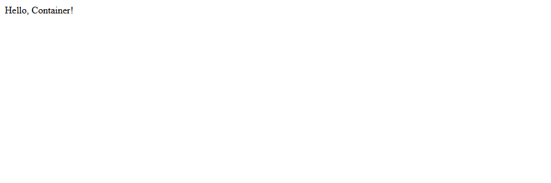
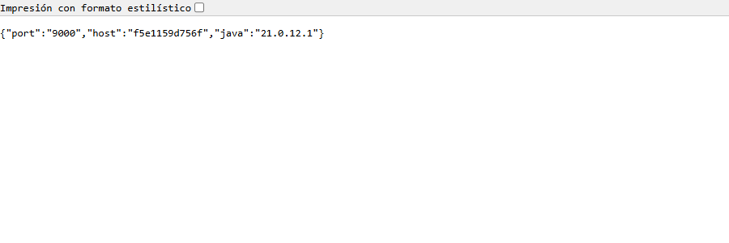
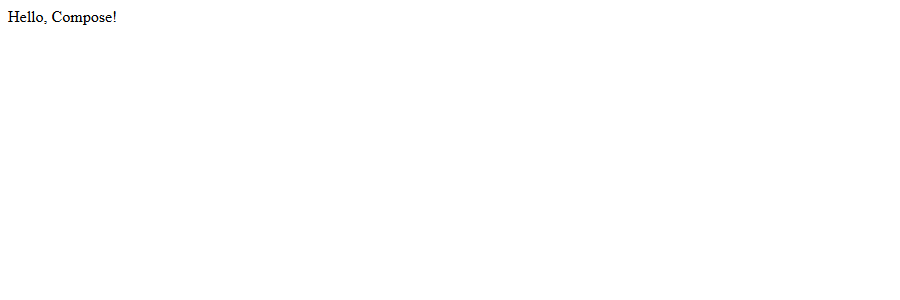
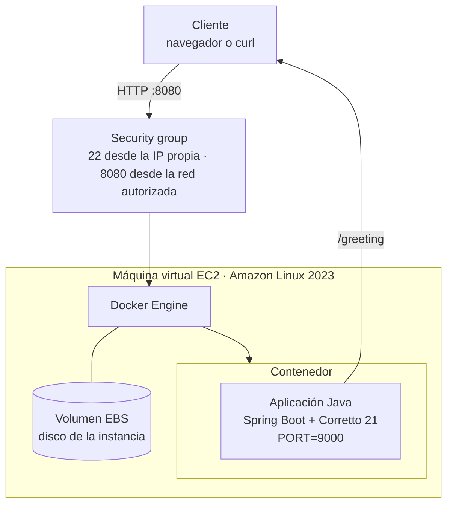

# virtualization-lab — Contenerización y despliegue de una aplicación web Java

Aplicación web mínima en Spring Boot empaquetada como imagen de Docker,
ejecutada en varios contenedores aislados sobre la misma máquina, orquestada
junto a MongoDB con Docker Compose, publicada en Docker Hub y desplegada en una
máquina virtual EC2 de AWS.

El taller trata la virtualización como un mecanismo de arquitectura: modularidad,
aislamiento, portabilidad y despliegue. Además del código, el repositorio
incluye el modelo de despliegue y un análisis de costos para tres volúmenes de
carga.

| | |
|---|---|
| Java | 21 (Amazon Corretto en la imagen) |
| Framework | Spring Boot 4.1.1 |
| Build | Maven |
| Imagen base | `amazoncorretto:21` |
| Puerto | `PORT`, 9000 por defecto |
| Orquestación local | Docker Compose v2 (probado con v5.1.4) |
| Registro de imágenes | Docker Hub |
| Nube | Amazon Linux 2023 sobre EC2 |

---

## El servicio

| Endpoint | Respuesta |
|---|---|
| `GET /greeting?name=Pedro` | `Hello, Pedro!` |
| `GET /greeting` | `Hello, World!` |
| `GET /whoami` | `{"host":"4e3ccbacf1fd","port":"9000","java":"21.0.12.1"}` |

`/whoami` se agregó para que el aislamiento se vea: dentro de un contenedor el
nombre de host es el id del contenedor, así que tres instancias de la misma
imagen responden con tres identidades distintas, y el Java que reportan es el de
la imagen, no el de la máquina.

### El puerto no está en el código

La aplicación toma el puerto de la variable `PORT`:

```java
application.setDefaultProperties(
        Map.of("server.port", System.getenv().getOrDefault("PORT", DEFAULT_PORT)));
```

Eso es lo que permite que el **mismo artefacto y la misma imagen** corran en el
computador, dentro de un contenedor con otro mapeo de puertos y en EC2, sin
recompilar nada.

> **Sobre el puerto por defecto:** el enunciado menciona 6000 en el texto y 9000
> en el código. Se dejó **9000**, que es el del código y el del `Dockerfile`,
> porque Chrome y Firefox bloquean el puerto 6000 (`ERR_UNSAFE_PORT`) y la
> verificación en el navegador no funcionaría.

## Estructura del proyecto

```
virtualization-lab/
├── pom.xml                     Spring Boot 4.1.1, Java 21
├── Dockerfile                  Imagen sobre amazoncorretto:21
├── compose.yaml                Servicios web + MongoDB con volúmenes
├── .dockerignore
├── README.md
├── docs/
│   ├── docker-evidence.txt     Transcripción de toda la ejecución
│   └── img/                    Capturas
└── src/
    ├── main/java/co/edu/escuelaing/virtualizationlab/
    │   ├── RestServiceApplication.java   Arranque y lectura de PORT
    │   └── HelloRestController.java      /greeting y /whoami
    └── test/java/co/edu/escuelaing/virtualizationlab/
        └── HelloRestControllerTest.java  4 pruebas con MockMvc
```

---

## Parte 1: construir y ejecutar la aplicación

```bash
mvn clean package
java -jar target/virtualization-lab.jar
```

```
Tomcat started on port 9000 (http) with context path '/'
Started RestServiceApplication in 1.827 seconds
```

Verificación: <http://localhost:9000/greeting?name=Pedro> → `Hello, Pedro!`


Para usar otro puerto:

```bash
PORT=8081 java -jar target/virtualization-lab.jar
```

Pruebas:

```bash
mvn test        # Tests run: 4, Failures: 0, Errors: 0
```

## Parte 2: la imagen de Docker y los contenedores

```bash
docker build -t brandoeci/virtualization-lab:1.0 .
docker images brandoeci/virtualization-lab
```

```
IMAGE                              ID             DISK USAGE   CONTENT SIZE
brandoeci/virtualization-lab:1.0   8e3575e55a5a        771MB          243MB
```

Tres instancias de la **misma imagen**, cada una en su propio puerto del host:

```bash
docker run -d --name virtualization-lab-1 -e PORT=9000 -p 34000:9000 brandoeci/virtualization-lab:1.0
docker run -d --name virtualization-lab-2 -p 34001:9000 brandoeci/virtualization-lab:1.0
docker run -d --name virtualization-lab-3 -p 34002:9000 brandoeci/virtualization-lab:1.0
docker ps
```

```
NAMES                  IMAGE                              STATUS         PORTS
virtualization-lab-3   brandoeci/virtualization-lab:1.0   Up 9 minutes   0.0.0.0:34002->9000/tcp
virtualization-lab-2   brandoeci/virtualization-lab:1.0   Up 9 minutes   0.0.0.0:34001->9000/tcp
virtualization-lab-1   brandoeci/virtualization-lab:1.0   Up 9 minutes   0.0.0.0:34000->9000/tcp
```

### Evidencia del aislamiento

```
$ curl http://localhost:34000/whoami
{"java":"21.0.12.1","port":"9000","host":"4e3ccbacf1fd"}
$ curl http://localhost:34001/whoami
{"java":"21.0.12.1","port":"9000","host":"f5e1159d756f"}
$ curl http://localhost:34002/whoami
{"java":"21.0.12.1","port":"9000","host":"9478bb04df4c"}
```

Tres procesos distintos, con tres sistemas de archivos y tres redes internas
distintas, corriendo la misma imagen. Todos usan **Java 21.0.12.1**, que es el
de la imagen, mientras la máquina anfitriona tiene Java 25: el contenedor lleva
su propio runtime y por eso el despliegue es reproducible.

Dentro del contenedor el puerto siempre es 9000; lo que cambia es el puerto del
host al que se mapea (`-p 34001:9000`).




## Parte 3: entorno multi-contenedor con Docker Compose

`compose.yaml` levanta la aplicación y una base MongoDB en la misma red:

```bash
docker compose up -d --build
docker compose ps
```

```
NAME                 IMAGE                    SERVICE   STATUS         PORTS
virtualization-db    mongo:8                  db        Up 1 minute    0.0.0.0:27017->27017/tcp
virtualization-web   virtualization-lab-web   web       Up 50 seconds  0.0.0.0:8087->9000/tcp
```

Verificación: <http://localhost:8087/greeting?name=Compose> → `Hello, Compose!`



La aplicación alcanza la base por el **nombre del servicio**, no por una IP:

```
$ docker compose exec web sh -c 'echo $SPRING_DATA_MONGODB_URI; getent hosts db'
SPRING_DATA_MONGODB_URI=mongodb://db:27017/workshop
172.21.0.2      db
```

Compose creó la red y el DNS interno solo. La base todavía no se usa para
guardar datos de la aplicación: está para ver cómo se declaran varios servicios,
su red, sus puertos y sus volúmenes.

```bash
docker compose exec db mongosh
> use workshop
> db.messages.insertOne({ message: "Hello from Docker Compose" })
> db.messages.find()
```

### Los volúmenes sobreviven a los contenedores

```
$ docker volume ls | grep virtualization
local     virtualization-lab_mongodb
local     virtualization-lab_mongodb_config

$ docker compose down     # borra los contenedores, conserva los volúmenes
$ docker compose up -d
$ docker compose exec db mongosh --eval 'db.messages.find()'
[ { _id: ObjectId('6abc49af236a414407c4bdf0'), message: 'Hello from Docker Compose' } ]
```

El documento sigue ahí después de borrar y recrear los contenedores: los datos
viven en el volumen, no en el contenedor. Con `docker compose down -v` sí se
borran.

## Parte 4: publicación en Docker Hub

```bash
docker login
docker tag brandoeci/virtualization-lab:1.0 brandoeci/virtualization-lab:latest
docker push brandoeci/virtualization-lab:1.0
docker push brandoeci/virtualization-lab:latest
```

**Repositorio de Docker Hub:** https://hub.docker.com/r/brandoeci/virtualization-lab

> **Estado:** la imagen está construida y etiquetada localmente con las dos
> etiquetas (`1.0` y `latest`). La publicación queda pendiente de la sesión de
> Docker Hub (`docker login`); sin ella el registro responde
> `push access denied ... insufficient_scope`.

## Parte 5: despliegue en AWS EC2

> **Estado:** procedimiento probado en local con la misma imagen; el despliegue
> público queda pendiente porque la cuenta de AWS del curso no tiene créditos
> disponibles.
>
> **URL pública:** _pendiente_ — `http://<dns-publico>:8080/greeting?name=AWS`

1. Crear una instancia EC2 con Amazon Linux 2023 (tipo `t3.micro`).
2. Configurar el security group con solo lo necesario:
   * SSH (22) **únicamente desde la IP pública propia**.
   * TCP 8080 desde la red que necesite consumir el servicio.
3. Conectarse e instalar Docker:
   ```bash
   sudo yum update -y
   sudo yum install -y docker
   sudo service docker start
   sudo usermod -a -G docker ec2-user
   ```
   Salir y volver a entrar para que el grupo `docker` tome efecto.
4. Traer la imagen y correrla:
   ```bash
   docker pull brandoeci/virtualization-lab:1.0
   docker run -d \
     --name virtualization-lab \
     --restart unless-stopped \
     -e PORT=9000 \
     -p 8080:9000 \
     brandoeci/virtualization-lab:1.0
   ```
5. Verificar:
   ```bash
   docker ps
   docker logs virtualization-lab
   curl localhost:8080/greeting?name=AWS
   ```
6. Probar desde el navegador: `http://<dns-publico>:8080/greeting?name=AWS`
7. **Terminar la instancia** al acabar, para no seguir pagando.

---

## Parte 6: modelo de despliegue y análisis de costos

### Modelo de despliegue



En texto:

```
Cliente
  ↓ petición HTTP
Máquina virtual EC2
  ↓
Docker Engine
  ↓
Contenedor con la aplicación web Java
```

### Responsabilidad de cada capa

| Capa | Responsabilidad |
|---|---|
| **Máquina virtual EC2** | Cómputo, memoria, almacenamiento y red aislados, alquilados por hora. Es lo que se paga aunque nadie use la aplicación. |
| **Security group** | Cortafuegos de la instancia: decide qué tráfico entrante puede llegar. Es la primera línea de defensa y por eso solo se abren 22 (desde una IP) y el puerto de la aplicación. |
| **Docker Engine** | Corre los contenedores, los aísla entre sí y mapea sus puertos a los de la máquina. |
| **Contenedor** | Entorno de ejecución portable: lleva la aplicación **y su runtime**. Es lo que hace que lo probado en el computador sea lo mismo que corre en la nube. |
| **Aplicación Java** | Atiende las peticiones HTTP y entrega la funcionalidad. |
| **Volumen EBS** | Disco persistente de la instancia; se paga por GB aprovisionado, se use o no. |

### Supuestos de carga

| Supuesto | Carga baja | Carga media | Carga alta |
|---|---|---|---|
| Peticiones por mes | 10.000 | 100.000 | 1.000.000 |
| Región | us-east-1 | us-east-1 | us-east-1 |
| Tipo de instancia | t3.micro (2 vCPU, 1 GiB) | t3.micro | t3.small (2 vCPU, 2 GiB) |
| Número de instancias | 1 | 1 | 2 detrás de un balanceador |
| Horas al mes | 730 (siempre encendida) | 730 | 730 |
| Almacenamiento EBS gp3 | 8 GB | 10 GB | 2 × 10 GB |
| Tamaño medio de petición + respuesta | 2 KB | 5 KB | 10 KB |
| Transferencia de salida | ~0,02 GB | ~0,5 GB | ~10 GB |
| Alta disponibilidad | No | No | Sí |

Precios de lista de us-east-1 usados en la estimación: EC2 `t3.micro`
**0,0104 USD/hora**, `t3.small` **0,0208 USD/hora**, EBS gp3 **0,08 USD por
GB-mes**, Application Load Balancer **0,0225 USD/hora** más las LCU, y salida a
internet **0,09 USD/GB** después de los primeros 100 GB del mes, que son
gratuitos (por eso la transferencia de los tres escenarios no genera cobro).

### Estimación mensual

| Escenario | Peticiones/mes | Cómputo | EBS | Balanceador | Transferencia | **Costo mensual** | **Costo por petición** | Principales generadores de costo |
|---|---|---|---|---|---|---|---|---|
| Carga baja | 10.000 | 7,59 USD | 0,64 USD | — | 0 USD | **8,23 USD** | **0,000823 USD** | Horas de la instancia y almacenamiento |
| Carga media | 100.000 | 7,59 USD | 0,80 USD | — | 0 USD | **8,39 USD** | **0,000084 USD** | Horas de la instancia y almacenamiento |
| Carga alta | 1.000.000 | 30,37 USD | 1,60 USD | ~18,40 USD | 0 USD | **50,37 USD** | **0,000050 USD** | Capacidad de cómputo, balanceador y redundancia |

```
Costo por petición = costo mensual de la infraestructura / peticiones del mes
```

Cálculo del cómputo: `0,0104 × 730 = 7,59` para una `t3.micro`, y
`0,0208 × 730 × 2 = 30,37` para dos `t3.small`.

> **Pendiente:** la captura o el archivo PDF/CSV exportado de la Calculadora de
> Precios de AWS. La tabla de arriba está calculada con los precios de lista
> citados; para la entrega hay que generar el estimado oficial en
> <https://calculator.aws/> con estos mismos supuestos y adjuntarlo en
> `docs/img/`.

### Discusión

**¿Por qué un despliegue en EC2 tiene un costo mensual base aunque reciba pocas
peticiones?**
Porque no se alquila trabajo, se alquila **capacidad**. La instancia se cobra por
hora encendida y el disco EBS por GB aprovisionado, sin importar si atendieron
diez peticiones o un millón. En el escenario de carga baja, las 10.000
peticiones cuestan lo mismo que costarían cero: 8,23 USD.

**¿A partir de qué nivel de carga el costo fijo pesa menos por petición?**
El costo mensual casi no cambia entre 10.000 y 100.000 peticiones (8,23 vs 8,39
USD), pero el costo por petición cae diez veces, de 0,000823 a 0,000084 USD. El
punto de quiebre está donde la instancia empieza a usarse de verdad: con una
`t3.micro` bien aprovechada, del orden de cientos de miles de peticiones al mes.
De ahí en adelante el costo fijo se diluye y lo que empieza a mandar es la
capacidad real (CPU, memoria y transferencia).

**¿Qué obligaría a pasar de una instancia a varias?**
Tres cosas distintas:
* **Capacidad**: la CPU o la memoria se saturan, o la latencia sube porque las
  peticiones hacen fila (exactamente el límite que se midió en el taller del
  servidor secuencial).
* **Disponibilidad**: con una sola instancia, cualquier falla o reinicio deja el
  servicio caído. Dos instancias en zonas de disponibilidad distintas eliminan
  ese punto único de falla.
* **Operación**: poder desplegar una versión nueva sin tumbar el servicio.

**¿Qué servicios adicionales necesitaría un despliegue de producción?**
Un balanceador (ALB) con verificación de salud, una base de datos administrada
(RDS o DocumentDB) en vez de un contenedor de base en la misma máquina, un
registro de imágenes privado (ECR), monitoreo y alarmas (CloudWatch), logs
centralizados, respaldos y snapshots, HTTPS con certificado (ACM), y un grupo de
autoescalado. Cada uno agrega costo fijo, así que en cargas pequeñas suelen
pesar más que la instancia misma.

**¿Sería más barato un despliegue serverless para la carga baja?**
Sí, y no por moda sino por la forma de la carga. 10.000 peticiones al mes son
unas 14 por hora: la instancia está ociosa más del 99 % del tiempo y aun así se
paga completa. Una función administrada cobra por invocación y por tiempo de
ejecución, así que 10.000 invocaciones cortas caen dentro o muy cerca de la capa
gratuita y costarían prácticamente cero. Serverless conviene cuando la carga es
**baja, intermitente y tolerante al arranque en frío**. Deja de convenir cuando
el tráfico es alto y sostenido (ahí la instancia reservada sale más barata por
petición), cuando el proceso debe mantener estado o conexiones largas, o cuando
el arranque en frío de la JVM es inaceptable para la latencia exigida.

### Conclusión

Para la carga baja y la media, una sola instancia `t3.micro` con el contenedor
es suficiente y cuesta menos de 9 USD al mes: es una decisión razonable para un
laboratorio o un servicio interno pequeño, aunque para 10.000 peticiones al mes
una opción serverless sería más barata. Para la carga alta, EC2 sigue siendo
apropiada, pero ya no como una máquina suelta: necesita al menos dos instancias
detrás de un balanceador, y el costo por petición baja a 0,00005 USD, que es
donde el modelo de máquinas alquiladas empieza a rendir.

---

## Evidencias

| Evidencia | Dónde está |
|---|---|
| Ejecución local | [docs/img/01-local-run.png](docs/img/01-local-run.png), [docker-evidence.txt](docs/docker-evidence.txt) §1 |
| Imagen construida | [docker-evidence.txt](docs/docker-evidence.txt) §2 |
| Tres contenedores corriendo y aislados | [02](docs/img/02-container-34000.png), [03](docs/img/03-container-34001-whoami.png), [docker-evidence.txt](docs/docker-evidence.txt) §3 |
| Docker Compose con MongoDB | [04](docs/img/04-compose-8087.png), [docker-evidence.txt](docs/docker-evidence.txt) §4 |
| Volúmenes que sobreviven | [docker-evidence.txt](docs/docker-evidence.txt) §5 |
| Imagen en Docker Hub | Pendiente de `docker login` |
| Despliegue en EC2 y URL pública | Pendiente de créditos de AWS |
| Estimado de la calculadora de AWS | Pendiente (tabla calculada con precios de lista) |
| Video de la demostración | Pendiente de grabar |

## Limitaciones conocidas

* La aplicación todavía no guarda nada en MongoDB; la base está en el entorno
  para mostrar cómo Compose maneja varios servicios, red y volúmenes.
* La imagen usa el JRE completo de `amazoncorretto:21` (243 MB de contenido);
  una imagen multi-etapa con `jlink` o una base `alpine` sería bastante más
  liviana.
* El despliegue expone HTTP plano, sin TLS ni autenticación.
* Una sola instancia es un solo punto de falla.

## Autor

**Hildebrando Peña Quezada** — Escuela Colombiana de Ingeniería Julio Garavito,
Taller de Desarrollo de Software Empresarial (TDSE).
GitHub: [@brandoeci](https://github.com/brandoeci)
